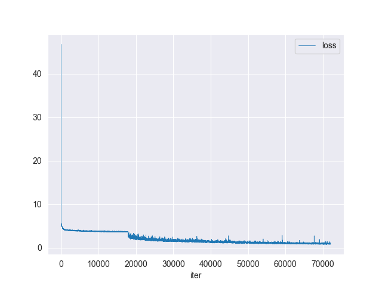

# Useful Tools

We provide some useful tools under `mmocr/tools` directory.

## Publish a Model

Before you upload a model to AWS, you may want to
(1) convert the model weights to CPU tensors, (2) delete the optimizer states and
(3) compute the hash of the checkpoint file and append the hash id to the filename. These functionalities could be achieved by `tools/publish_model.py`.

```shell
python tools/publish_model.py ${INPUT_FILENAME} ${OUTPUT_FILENAME}
```

For example,

```shell
python tools/publish_model.py work_dirs/psenet/latest.pth psenet_r50_fpnf_sbn_1x_20190801.pth
```

The final output filename will be `psenet_r50_fpnf_sbn_1x_20190801-{hash id}.pth`.


## Convert txt annotation to lmdb format
Sometimes, loading a large txt annotation file with multiple workers can cause OOM (out of memory) error. You can convert the file into lmdb format using `tools/data/utils/txt2lmdb.py` and use LmdbLoader in your config to avoid this issue.
```bash
python tools/data/utils/txt2lmdb.py -i <txt_label_path> -o <lmdb_label_path>
```
For example,
```bash
python tools/data/utils/txt2lmdb.py -i data/mixture/Syn90k/label.txt -o data/mixture/Syn90k/label.lmdb
```


## Log Analysis

You can use `tools/analyze_logs.py` to plot loss/hmean curves given a training log file. Run `pip install seaborn` first to install the dependency.



 ```shell
python tools/analyze_logs.py plot_curve [--keys ${KEYS}] [--title ${TITLE}] [--legend ${LEGEND}] [--backend ${BACKEND}] [--style ${STYLE}] [--out ${OUT_FILE}]
 ```

| Arguments   | Type | Description                                                                                                     |
| ----------- | ---- | --------------------------------------------------------------------------------------------------------------- |
| `--keys`    | str  | The metric that you want to plot. Defaults to `loss`.                                                           |
| `--title`   | str  | Title of figure.                                                                                                |
| `--legend`  | str  | Legend of each plot.                                                                                            |
| `--backend` | str  | Backend of the plot. [more info](https://matplotlib.org/stable/users/explain/backends.html)                     |
| `--style`   | str  | Style of the plot. Defaults to `dark`. [more info](https://seaborn.pydata.org/generated/seaborn.set_style.html) |
| `--out`     | str  | Path of output figure.                                                                                          |

**Examples:**

Download the following DBNet and CRNN training logs to run demos.
```shell
wget https://download.openmmlab.com/mmocr/textdet/dbnet/dbnet_r18_fpnc_sbn_1200e_icdar2015_20210329-ba3ab597.log.json -O DBNet_log.json

wget https://download.openmmlab.com/mmocr/textrecog/crnn/20210326_111035.log.json -O CRNN_log.json
```

Please specify an output path if you are running the codes on systems without a GUI.

- Plot loss metric.

  ```shell
  python tools/analyze_logs.py plot_curve DBNet_log.json --keys loss --legend loss
  ```

- Plot hmean-iou:hmean metric of text detection.

  ```shell
  python tools/analyze_logs.py plot_curve DBNet_log.json --keys hmean-iou:hmean --legend hmean-iou:hmean
  ```

- Plot 0_1-N.E.D metric of text recognition.

  ```shell
  python tools/analyze_logs.py plot_curve CRNN_log.json --keys 0_1-N.E.D --legend 0_1-N.E.D
  ```

- Compute the average training speed.

  ```shell
  python tools/analyze_logs.py cal_train_time CRNN_log.json --include-outliers
  ```

  The output is expected to be like the following.

  ```text
  -----Analyze train time of CRNN_log.json-----
  slowest epoch 4, average time is 0.3464
  fastest epoch 5, average time is 0.2365
  time std over epochs is 0.0356
  average iter time: 0.2906 s/iter
  ```
